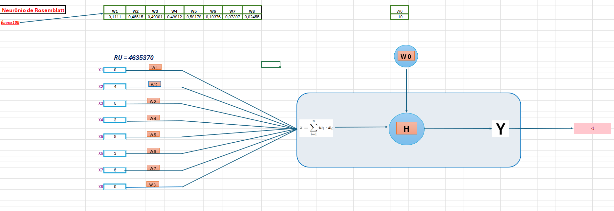
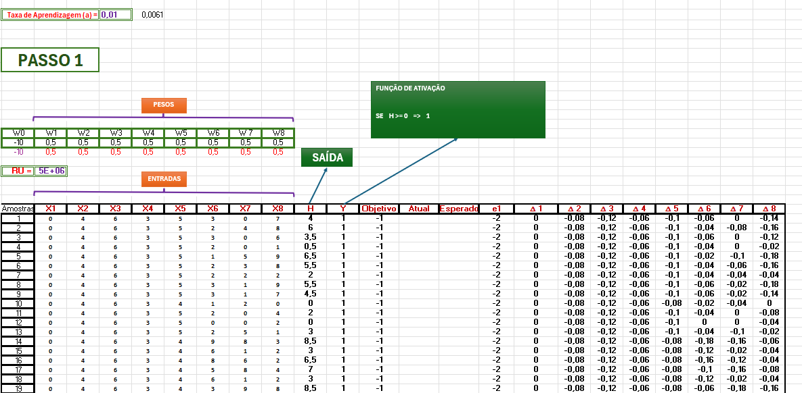

# 🧠 Neurônio de Rosenblatt Treinado em Planilha

Este projeto apresenta um neurônio de Rosenblatt (Perceptron de camada única) implementado e treinado **inteiramente em uma planilha**, com visualização e ajustes dinâmicos. O objetivo é demonstrar, de forma didática, os fundamentos do Perceptron, incluindo o cálculo dos pesos, bias e função de ativação.

---

## 📌 Sobre o Projeto

A planilha contém duas abas principais:

1. **Neurônio**: Interface visual onde o RU (limiar) pode ser alterado para observar o comportamento da ativação do neurônio.
2. **Treinamento**: Cálculo manual do ajuste de pesos com base em acertos e erros, incluindo a regra de atualização do Perceptron.

---

## 📊 Conceitos Envolvidos

### 🧮 Fórmulas do Perceptron

```
y' = 1, se soma_ponderada + bias >= RU
y' = 0, caso contrário
```

Onde:
- `x_i` = entradas
- `w_i` = pesos
- `b` = bias
- **RU** = valor de limiar dinâmico (controlado na planilha)

### 🔁 Regra de Atualização

```
w_i = w_i + η * (y - y') * x_i
b = b + η * (y - y')
```

- `η` = taxa de aprendizado (learning rate)
- `y` = valor esperado
- `y'` = valor previsto

---

## 🔧 RU como Limiar de Ativação

Na aba **Neurônio**, é possível alterar o valor do **RU** dinamicamente. Ele atua como o **limiar de ativação**:

- Se a **soma ponderada** for **maior ou igual ao RU**, o neurônio é ativado (retorna 1).
- Se for **menor**, o neurônio permanece inativo (retorna 0).

O comportamento visual da célula muda conforme o RU:
- ✅ Neurônio ativado: **verde**
- ❌ Neurônio inativo: **vermelho**

---

## 🧪 Exemplos de Entrada

| Entrada x1 | Entrada x2 | Pesos w1/w2 | Bias | RU | Ativação |
|------------|------------|--------------|------|----|----------|
| 1          | 1          | 0.4 / 0.6     | 0.2  | 1  | ✅       |
| 0          | 1          | 0.4 / 0.6     | 0.2  | 1  | ❌       |

---

## 📁 Estrutura da Planilha

```
📄 Final - Atividade Pratica.xlsx
├── 🧠 Neurônio          → Interface com limiar (RU)
└── 📈 Treinamento       → Ajuste dos pesos e bias
```

---

## 📎 Download da Planilha

👉 [Clique aqui para baixar](Final%20-%20Atividade%20Pratica.xlsx)

---
## Print Tela Rede Neural


---
---
## Print Tela Treinamento


---
---

## 🎥 Demonstração em Vídeo

####Veja o neurônio em ação na planilha:

📹 [`Clique aqui para assistir`](video_neuronio.mp4)


## 🧑‍💻 Autor

**Rodrigo Ribeiro Carvalho**  
GitHub: [Rodrigo-RRC](https://github.com/Rodrigo-RRC)  
LinkedIn: [linkedin.com/in/rodrigo-ribeiro-datascience](https://www.linkedin.com/in/rodrigo-ribeiro-datascience)

---

## ✅ Status: Projeto Concluído e Funcional

Este projeto faz parte do meu portfólio de aprendizado prático em ciência de dados e redes neurais.
